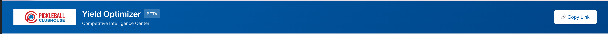

# Sprint 10: Sticky Header & Banner Redesign

**Objective:** Enhance the user experience by making the main application header sticky and redesigning it with a clean, white background for a more modern, seamless look.

---

## User Stories

1.  **Sticky Header:** As a user, when I scroll down the page, I want the top banner to stay fixed at the top of the screen so that I always have context and access to header elements.
2.  **Banner Redesign:** As a user, I want the top banner to have a clean, white background to better integrate the logo and a blue color scheme for text and highlights to maintain brand identity.

### Visual Reference:

The element to be made sticky and redesigned is the main header bar.



---

## Technical Implementation Plan

The implementation will be done primarily with CSS and potentially minor HTML adjustments.

1.  **Identify the Header Element:**
    *   In `/Users/petergiordano/Documents/GitHub/pcc-yield-optimizer/index.html`, locate the primary `<header>` or `<div>` element that wraps the top banner.
    *   Ensure this element has a unique and descriptive class or ID, for example, `.main-header`.

2.  **Apply Updated Header Styles:**
    *   In `/Users/petergiordano/Documents/GitHub/pcc-yield-optimizer/css/main.css` or `/Users/petergiordano/Documents/GitHub/pcc-yield-optimizer/css/components.css`, apply the following styles:

    ```css
    /* Main sticky header container */
    .main-header {
      position: sticky;
      top: 0;
      z-index: 1000;
      background-color: #FFFFFF; /* White background for a seamless logo */
      border-bottom: 1px solid #E5E7EB; /* Subtle border for separation */
      padding: 12px 24px; /* Adjust padding as needed */
    }

    /* Target the main title text, e.g., "Yield Optimizer" */
    .main-header .header-title {
      color: #004a87; /* PCC brand blue */
    }

    /* Target the subtitle text, e.g., "Competitive Intelligence Center" */
    .main-header .header-subtitle {
      color: #005DAA; /* A slightly lighter blue */
    }

    /* Style the BETA tag */
    .main-header .beta-tag {
      background-color: #DBEAFE; /* Light blue background */
      color: #1E40AF;           /* Dark blue text */
      border: none;
    }

    /* Invert the "Copy Link" button style */
    .main-header .copy-link-btn {
      background-color: #FFFFFF;
      color: #005DAA;
      border: 1px solid #BFDBFE;
    }

    .main-header .copy-link-btn:hover {
      background-color: #F9FAFB;
      border-color: #93C5FD;
    }
    ```
    *Note: The selectors `.header-title`, `.header-subtitle`, `.beta-tag`, and `.copy-link-btn` are examples. You may need to inspect `index.html` to find the correct selectors for these elements.*

3.  **Adjust Main Content Layout:**
    *   Making the header sticky will remove it from the normal document flow. To prevent the content below it from being obscured, identify the main content container (e.g., `<main>`, or a `div` with a class like `.content-wrapper`).
    *   Add a `padding-top` to this container equal to the height of the new sticky header.

    **Example CSS:**
    ```css
    .content-wrapper {
      padding-top: 85px; /* Adjust this value to match the final height of the header */
    }
    ```

---

## Acceptance Criteria

- [ ] The header bar is white and remains fixed at the top of the viewport when scrolling.
- [ ] The text ("Yield Optimizer", "Competitive Intelligence Center") within the header is blue.
- [ ] The "BETA" tag and "Copy Link" button are styled with the new blue color scheme.
- [ ] The logo appears seamless against the white background.
- [ ] A subtle 1px border is visible at the bottom of the header.
- [ ] The main page content is not hidden by the sticky header.
- [ ] The layout is responsive and works correctly on various screen sizes.
