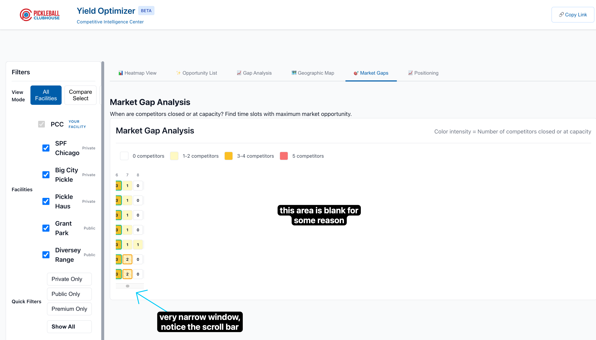

# Bug Report: BUG_05_Market_Gaps

**Title:** Market Gaps tab has a broken layout with a narrow content window and large blank space.

---

## 1. Problem Description

As shown in the screenshot, the "Market Gaps" tab is not rendering correctly. The main content, which should be a 7-day by 24-hour heatmap grid, is constrained to a very narrow column on the left. This creates a horizontal scrollbar for a very small area, leaving a large, unused blank space to the right.



**Symptoms:**
- The heatmap grid does not expand to fill the available width of the content area.
- A horizontal scrollbar appears for a very narrow container.
- The majority of the tab's content area is blank.

---

## 2. Diagnosis (Root Cause Analysis)

The root cause is missing CSS layout properties for the container that holds the heatmap grid cells.

1.  The `MarketGapHeatmapComponent` in `js/components/market-gap-heatmap.js` dynamically generates a series of `<div>` elements (for headers and cells) inside a single parent `div` with the class `.heatmap-grid-container`.
2.  However, there are no corresponding CSS rules in the project to tell `.heatmap-grid-container` how to arrange these child `<div>`s into a grid.
3.  Without `display: grid` and `grid-template-columns`, the browser does not know how to create the 25-column layout required for the heatmap. The elements are likely wrapping incorrectly or defaulting to a minimal width, causing the container to collapse horizontally.

---

## 3. Proposed Solution

The fix is to add the necessary `display: grid` styling to the `.heatmap-grid-container` element.

**File to Modify:** `/Users/petergiordano/Documents/GitHub/pcc-yield-optimizer/css/components.css`

**Add the following CSS rules:**

```css
/* Add this to the end of the Market Gap Heatmap styles */

.heatmap-grid-container {
  display: grid;
  /* Define 25 columns: 1 for day labels, 24 for hours */
  grid-template-columns: 60px repeat(24, 32px);
  gap: 2px;
  padding-bottom: 10px; /* Add some padding for the scrollbar */
}

/* It is also recommended to ensure the parent container can scroll if needed */
.market-gap-heatmap-container {
  overflow-x: auto; /* Allows the card to scroll horizontally on smaller screens */
}
```

### Explanation:

*   `display: grid;` tells the browser to treat this container as a CSS Grid.
*   `grid-template-columns: 60px repeat(24, 32px);` defines the grid structure:
    *   The first column (for day labels like "Mon", "Tue") is given a fixed width of `60px`.
    *   The next 24 columns (for the hours 0-23) are each given a fixed width of `32px`, matching the width of the `.market-gap-cell`.
*   `overflow-x: auto;` on the parent container is a defensive measure to ensure that if the viewport becomes too narrow, the entire grid will scroll cleanly within its card.

This change will force the grid to render in its intended 25-column layout, filling the horizontal space and resolving the UI bug.
